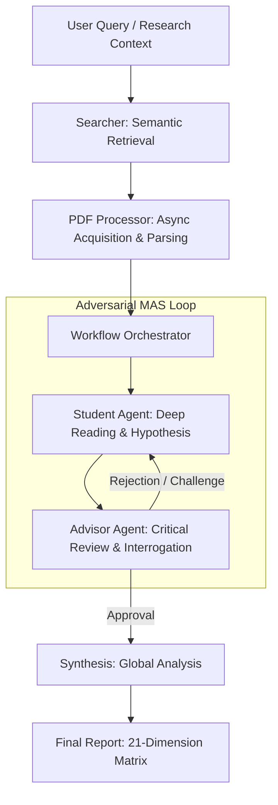

# FindUrCite: Autonomous Research Agent with Adversarial Dialectic
# FindUrCite: 基于对抗辩证机制的自主科研智能体系统

[English](#english) | [中文](#chinese)

---

<a name="english"></a>

## 🇬🇧 Abstract

**FindUrCite** is an autonomous research framework based on **Multi-Agent System (MAS)** architecture. It addresses the hallucination issues inherent in Large Language Models (LLMs) during academic literature synthesis by implementing an adversarial **"Student-Advisor"** debate mechanism. By simulating the rigor of an academic defense, the system enforces strict evidence chain verification, ensuring that every insight is grounded in verifiable textual evidence from the source literature.

[](LICENSE)
[](https://www.python.org/)
[](https://ollama.com/)

### 🛠️ Key Technical Features

- **Adversarial Dialectical Engine**: Unlike generative summarization tools, FindUrCite employs a dual-agent architecture. The `Advisor Agent` acts as an **Adversarial Reviewer**, conducting multi-round interrogation of the `Student Agent`'s analysis. It challenges the methodology, relevance, and logical consistency of the findings, accepting only those that withstand rigorous scrutiny.
- **Verifiable Evidence Chain (Zero-Hallucination)**: Implements a strict **"No Citation, No Output"** policy. The system utilizes Chain-of-Thought (CoT) reasoning to ensure that every analytical claim is mapped directly to specific text segments (quotes) within the source PDF, guaranteeing traceability.
- **Full-Stack Local Research Automation**: Orchestrates a complete closed-loop workflow locally, including semantic search (Semantic Scholar/ArXiv), concurrent PDF acquisition, robust parsing, adversarial debate, multi-dimensional scoring, and comprehensive report synthesis.
- **Modern Streamlit UI**: Provides a chat-like interface for real-time interaction, visualizing the debate process and offering direct access to found papers and generated reports.
- **Privacy-First Architecture**: Optimized for local deployment using **Ollama**, supporting high-performance open-source models (e.g., Qwen 2.5, DeepSeek R1) to ensure the confidentiality of research topics and data.

### 🏗️ System Architecture

The system follows a Directed Acyclic Graph (DAG) workflow with an internal feedback loop for the debate phase:



### 📈 Roadmap
- [x] **Multi-dimensional Scoring**: 0-10 scoring based on relevance, innovation, reliability, and potential.
- [x] **Dynamic Interrogation**: Advisor initiates deep questioning for high-scoring papers.
- [x] **Dynamic Model Switching**: Support seamless model switching at runtime.
- [x] **Parallel Search & Analysis**: Optimized search and analysis workflows for efficiency.
- [x] **Session Persistence**: Prevents data loss on page refresh.
- [ ] **Zotero Integration**: Analyze directly from Zotero libraries.
- [ ] **Local Knowledge Base**: Support batch review of local PDF folders.

### 🚀 Quick Start

#### 1. Prerequisites
- **Operating System**: Windows 11 (Scripts optimized for PowerShell 5+)
- **Runtime Environment**: Python 3.10+
- **Inference Engine**: [Ollama](https://ollama.com/) (Auto-installed by script if missing)
- **Recommended Models**: 
  - **Balanced**: `qwen2.5:7b` (Requires ~6GB VRAM)
  - **Reasoning-Enhanced**: `deepseek-r1:8b` (Requires ~8GB VRAM)

#### 2. Automated Deployment
Initialize the environment and start the service using the provided automation script:

```powershell
./run.bat
```

**The script performs the following operations automatically:**
1. Checks for Python and Ollama dependencies (Auto-installs Ollama if not found).
2. Creates a virtual environment (`venv`) and installs Python dependencies.
3. Interactively selects and pulls the specified LLM model.
4. Launches the Streamlit Web App in your default browser.

### 📊 Core Modules

| Module | Description | Key Path |
| :--- | :--- | :--- |
| **Agents** | Defines the personae, system prompts, and reasoning logic for Student/Advisor agents. | `src/agents/` |
| **Workflow** | Manages the debate state machine, scoring algorithms, and consensus mechanisms. | `src/workflow.py` |
| **Processor** | Handles robust PDF ingestion, layout analysis, and semantic text extraction. | `src/pdf_processor.py` |
| **Web App** | Streamlit-based UI for interaction and visualization. | `src/web_app.py` |

---

<a name="chinese"></a>

## ⚠️ 免责声明 (Disclaimer)

本系统仅供**学术研究与实验使用**。

1.  **幻觉风险**：虽然 FindUrCite 采用了证据链校验机制，但大模型（LLM）仍可能对文献内容产生误读或生成看似合理实则错误的总结。**请务必查阅原始 PDF 文献以核实引用。**
2.  **无担保声明**：软件按“原样”提供，不提供任何形式的明示或暗示担保。
3.  **学术诚信**：用户有责任确保使用本工具符合所在机构的学术诚信政策。严禁使用本工具直接生成论文或规避正常的科研劳动。

## 🇨🇳 中文介绍


**FindUrCite** 是一款基于**多智能体博弈 (Multi-Agent System)** 架构的自主科研智能体系统。针对大语言模型在学术文献综述中常见的“幻觉”问题，本系统引入了** “学生-导师”对抗辩证机制 **。通过模拟严苛的学术答辩过程，强制执行证据链校验，确保每一条研究结论都建立在可追溯的原文证据之上。

### 🛠️ 核心技术特性

- **对抗式辩证引擎 (Adversarial Dialectical Engine)**：区别于传统的单向生成式摘要工具，系统内置了双智能体架构。`Advisor Agent` 担任**对抗性审查者 (Adversarial Reviewer)** 的角色，对 `Student Agent` 的分析结论进行多轮次、深层次的质询与挑战。只有逻辑严密、证据确凿的分析才能通过审查。
- **可验证证据链 (Verifiable Evidence Chain)**：执行严格的 **“无引证，不输出”** 策略。利用思维链 (CoT) 技术，强制要求所有分析观点必须映射到 PDF 原文中的具体文本片段 (Quotes)，从而彻底杜绝信息捏造。
- **全栈本地化科研自动化**：在本地闭环完成从语义搜索 (Semantic Scholar/ArXiv)、高并发 PDF 获取、鲁棒性解析、对抗博弈分析、多维度评分到最终报告生成的完整工作流。
- **现代化 Streamlit 界面**：提供类似聊天的交互界面，实时可视化智能体辩论过程，并支持直接下载论文和生成的研究报告。
- **隐私优先架构**：专为本地部署设计，深度适配 **Ollama** 推理引擎，支持 Qwen 2.5、DeepSeek R1 等高性能开源模型，严格保障科研课题与数据的私密性。

### 🏗️ 系统架构

系统采用有向无环图 (DAG) 工作流，并在博弈阶段包含内部反馈循环（见上方英文版 Mermaid 图表）。

### 🚀 快速开始

#### 1. 环境准备
- **操作系统**: Windows 11 (已针对 PowerShell 5+ 进行脚本优化)
- **运行环境**: Python 3.10+
- **推理引擎**: [Ollama](https://ollama.com/) (若未安装，脚本将自动尝试安装)
- **推荐模型**: 
  - **平衡型**: `qwen2.5:7b` (显存需求约 6GB)
  - **推理增强型**: `deepseek-r1:8b` (显存需求约 8GB)

#### 2. 自动化部署
使用项目提供的一键启动脚本初始化环境并运行服务：

```powershell
./run.bat
```

**该脚本将自动执行以下操作：**
1. 检测系统 Python 环境与 Ollama 服务状态（缺失时自动安装 Ollama）。
2. 创建独立虚拟环境 (`venv`) 并安装依赖。
3. 交互式选择并自动拉取指定的大语言模型。
4. 启动 Streamlit Web 应用并自动打开浏览器。

### 📊 核心模块说明

| 模块名称 | 功能描述 | 关键路径 |
| :--- | :--- | :--- |
| **Agents** | 定义学生/导师智能体的人格设定、系统提示词 (Prompt) 及推理逻辑。 | `src/agents/` |
| **Workflow** | 管理博弈状态机、评分算法、轮次控制及共识达成机制。 | `src/workflow.py` |
| **Processor** | 负责 PDF 文档的鲁棒性加载、版面分析及语义文本提取。 | `src/pdf_processor.py` |
| **Web App** | 基于 Streamlit 的交互式前端界面。 | `src/web_app.py` |


### 📈 路线图 (Roadmap)
- [x] **多维度量化评分**: 实现基于相关性、创新性、可靠性、潜力的 0-10 分制评估。
- [x] **动态质询机制**: 引入 Advisor 对高分论文的深层追问与反思环节。
- [x] **多模型动态切换**: 支持运行时无缝切换推理模型。
- [x] **并行搜索与分析**: 优化搜索和分析流程，大幅提升效率。
- [x] **持久化会话**: 防止页面刷新导致数据丢失。
- [ ] **Zotero 生态集成**: 支持直接读取 Zotero 库进行分析。
- [ ] **本地知识库支持**: 支持导入本地 PDF 文件夹进行批量综述。

## 📜 许可证 / License
[MIT License](LICENSE)
