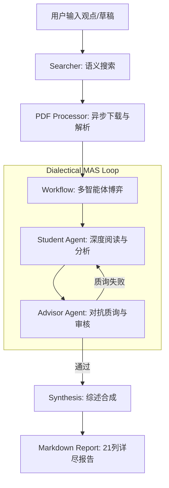

# FindUrCite: 多智能体辩证科研分析系统 / Multi-Agent Dialectical Research Analysis System

[English](#english) | [中文](#chinese)

FindUrCite 是一款基于多智能体博弈（Multi-Agent System）架构的科研文献深度分析工具。它通过模拟“学生-导师”之间的对抗式辩论，强制进行证据链提取与逻辑校验，旨在彻底解决大模型在科研综述中的幻觉问题。

FindUrCite is a deep literature analysis tool based on a Multi-Agent System (MAS) architecture. By simulating an adversarial debate between a "Student" and an "Advisor," it enforces evidence chain extraction and logical verification, aiming to eliminate LLM hallucinations in research synthesis.

[](LICENSE)
[](https://www.python.org/)
[](https://ollama.com/)

---

<a name="chinese"></a>

## 🇨🇳 中文说明

### 🛠️ 工程化核心特性

- **辩证博弈引擎 (Dialectical Engine)**：不同于单向生成的摘要工具，系统内置 `Student` 与 `Advisor` 智能体。`Advisor` 会扮演“杠精”角色，对 `Student` 的分析进行多轮质询，只有通过证据校验的结论才会被采纳。
- **零幻觉证据系统 (Evidence Chain)**：强制执行“无原文引证不输出”策略。每一项分析结果必须映射到 PDF 原文中的具体 Quote。
- **全自动本地流水线**：集成搜索（Semantic Scholar/ArXiv）、PDF 异步下载、语义解析、多轮博弈、多维度评分及报告生成，实现一键式科研闭环。
- **异步流式渲染**：基于 FastAPI WebSocket 实现事件流，前端实时展示智能体辩论过程，支持多模型动态切换。
- **本地部署优先**：支持 Ollama 全系列模型（Qwen2.5, DeepSeek R1 等），确保研究数据的隐私安全。

### 🏗️ 系统架构



### 🚀 快速开始

#### 1. 环境准备
- **操作系统**: Windows 11 (已优化批处理脚本)
- **环境要求**: Python 3.10+, [Ollama](https://ollama.com/)
- **本地模型**: 推荐 `qwen2.5:7b` (平衡) 或 `deepseek-r1:8b` (推理)

#### 2. 一键启动
本项目提供完全自动化的 Windows 部署脚本：
```powershell
./run.bat
```
该脚本将自动完成：虚拟环境创建、依赖安装、模型自动拉取、服务部署及浏览器自动启动。

---

<a name="english"></a>

## 🇬🇧 English Description

### 🛠️ Key Engineering Features

- **Dialectical Debate Engine**: Unlike one-way summarization tools, the system features `Student` and `Advisor` agents. The `Advisor` acts as a "Devil's Advocate," performing multi-round interrogation of the `Student`'s analysis. Only evidence-backed conclusions are accepted.
- **Zero-Hallucination Evidence System**: Enforces a strict "No Quote, No Claim" policy. Every analytical point must be mapped to a direct quote from the original PDF.
- **Automated Local Pipeline**: Integrated search (Semantic Scholar/ArXiv), asynchronous PDF downloading, semantic parsing, multi-agent debate, multi-dimensional scoring, and report generation in a one-click closed loop.
- **Async Stream Rendering**: Real-time event streaming via FastAPI WebSockets, displaying the live debate between agents with dynamic model switching support.
- **Privacy-First Local Deployment**: Supports the full range of Ollama models (Qwen2.5, DeepSeek R1, etc.), ensuring your research data remains private.

### 🏗️ System Architecture

(See the Mermaid diagram in the Chinese section above.)

### 🚀 Quick Start

#### 1. Prerequisites
- **OS**: Windows 11 (Optimized batch scripts provided)
- **Requirements**: Python 3.10+, [Ollama](https://ollama.com/)
- **Recommended Models**: `qwen2.5:7b` (Balanced) or `deepseek-r1:8b` (Reasoning)

#### 2. One-Click Launch
FindUrCite provides a fully automated Windows deployment script:
```powershell
./run.bat
```
This script handles: Virtual environment setup, dependency installation, model pulling, server deployment, and automatic browser launch.

---

## 📊 核心模块 / Core Modules

| 模块 / Module | 说明 / Description | 关键文件 / Key Files |
| :--- | :--- | :--- |
| **Agents** | 定义智能体 Prompts 和推理链 / Defined Agent Prompts and CoT | `src/agents/` |
| **Workflow** | 管理博弈状态机与打分逻辑 / Logic for Debate State Machine and Scoring | `src/workflow.py` |
| **Processor** | PDF 解析与文本提取 / PDF Parsing and Text Extraction | `src/pdf_processor.py` |
| **Server** | WebSocket 通信与静态服务 / WebSocket Comm and Static Serving | `src/server.py` |

---

## 🛡️ 开发规范 / Development & Logs

项目遵循严格的开发规范，已知问题与解决方案见 [error_log.md](error_log.md)。
FindUrCite follows strict engineering standards. For known issues and fixes, see [error_log.md](error_log.md).

## 📈 路线图 / Roadmap
- [x] 多维度打分 / Multi-dimensional Scoring
- [x] 动态质询阶段 / Dynamic Interrogation Phases
- [x] 多模型切换 / Multi-model Switching
- [ ] Zotero 集成 / Zotero Integration
- [ ] 本地库分析 / Local Library Analysis

## 📜 许可证 / License
[MIT License](LICENSE)
