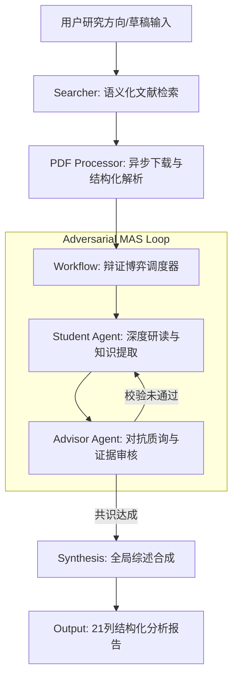

# FindUrCite: 多智能体辩证科研分析系统 / Multi-Agent Dialectical Research Analysis System

[English](#english) | [中文](#chinese)

FindUrCite 是一款基于多智能体博弈（Multi-Agent System）架构的深度学术文献调研工具。它通过模拟“研究员-评审员”之间的对抗式辩论，强制执行证据链提取与逻辑校验，旨在解决大语言模型在科研综述中的幻觉问题，为科研人员提供严谨、可追溯的文献分析报告。

FindUrCite is an advanced literature analysis framework powered by a Multi-Agent System (MAS). By simulating an adversarial debate between a "Researcher" and a "Reviewer," it enforces rigorous evidence chain extraction and logical verification. The system is specifically designed to mitigate LLM hallucinations in academic synthesis, providing researchers with highly accurate, traceable, and critical literature insights.

[](LICENSE)
[](https://www.python.org/)
[](https://ollama.com/)

---

<a name="chinese"></a>

## 🇨🇳 中文说明

### 🛠️ 核心工程特性

- **辩证博弈引擎 (Dialectical Engine)**：系统内置 `Student`（研究员）与 `Advisor`（评审员）双智能体。`Advisor` 扮演“批判性审核者”角色，对 `Student` 提交的分析报告进行多维度的对抗式质询。只有通过严格证据校验的结论才会被系统采纳，确保了分析的深度与客观性。
- **零幻觉证据链 (Zero-Hallucination Evidence Chain)**：强制执行“无原文引证不输出”的准则。系统生成的每一项核心发现必须精确映射到 PDF 原文中的具体片段（Quotes），实现了从结论到证据的闭环追踪。
- **自动化科研流水线 (Automated Research Pipeline)**：集成语义搜索（Semantic Scholar/ArXiv）、异步 PDF 抓取、启发式语义解析、多轮博弈逻辑、多维度量化评分及最终综述生成，提供一站式、闭环式的科研分析体验。
- **实时事件驱动渲染 (Event-Driven Rendering)**：基于 FastAPI WebSocket 构建，前端实时流式展示智能体之间的辩论过程与思维轨迹，支持多模型（Qwen2.5, DeepSeek R1 等）的动态热切换。
- **私有化安全部署 (Privacy-First Deployment)**：全面适配 Ollama 本地推理引擎，所有文献处理与模型推理均在本地完成，保障核心研究数据的隐私与安全。

### 🏗️ 系统架构



---

<a name="english"></a>

## 🇬🇧 English Description

### 🛠️ Key Engineering Features

- **Dialectical Reasoning Engine**: The system features a dual-agent architecture comprising a `Student` (Researcher) and an `Advisor` (Reviewer). The `Advisor` functions as a "Critical Reviewer," performing adversarial interrogation on the initial findings. Only findings that survive rigorous evidence validation are accepted, ensuring analytical depth and objectivity.
- **Zero-Hallucination Evidence Chain**: Implements a strict "Evidence-First" policy. Every analytical claim generated by the system must be precisely mapped to direct quotes from the original PDF, creating a verifiable link between AI insights and source data.
- **Automated Research Pipeline**: A seamless, one-click workflow integrating semantic search (Semantic Scholar/ArXiv), asynchronous PDF retrieval, heuristic parsing, multi-agent debate logic, multi-dimensional scoring, and final synthesis generation.
- **Real-time Event Streaming**: Powered by FastAPI WebSockets, the frontend provides a live stream of the agents' internal reasoning and debate process, with full support for dynamic model switching (e.g., Qwen2.5, DeepSeek R1).
- **Privacy-Centric Local Deployment**: Fully optimized for the Ollama inference engine. All data processing and LLM reasoning occur locally, ensuring the highest level of security for sensitive research materials.

### 🏗️ System Architecture

(Please refer to the Mermaid diagram in the Chinese section above.)

### 🚀 快速开始 / Quick Start

#### 1. 环境准备 / Prerequisites
- **OS**: Windows 11 (Optimized)
- **Runtime**: Python 3.10+, [Ollama](https://ollama.com/)
- **Models**: Recommended `qwen2.5:7b` (Standard) or `deepseek-r1:8b` (Reasoning-Heavy)

#### 2. 一键部署 / One-Click Launch
```powershell
./run.bat
```
该脚本将自动化完成环境校验、依赖安装、模型拉取及服务启动。 / This script automates environment checks, dependency installation, model pulling, and server deployment.

---

## 📊 模块对照表 / Core Modules Mapping

| 模块 / Module | 专业描述 / Technical Description | 核心文件 / Core Files |
| :--- | :--- | :--- |
| **Agents** | 定义智能体人格属性、思维链 (CoT) 及系统提示词 / Defines Agent Personas, CoT, and System Prompts | `src/agents/` |
| **Workflow** | 管理多轮辩论的状态机、分段打分逻辑及共识机制 / Orchestrates State Machine, Scoring Logic, and Consensus | `src/workflow.py` |
| **Processor** | 负责 PDF 的鲁棒性解析、布局分析与文本提取 / Robust PDF Ingestion, Layout Analysis, and Text Extraction | `src/pdf_processor.py` |
| **Server** | 提供 WebSocket 实时事件流与静态资源托管 / WebSocket Event Streaming and Static File Serving | `src/server.py` |

---

## 🛡️ 开发规范与日志 / Standards & Error Logs

FindUrCite 遵循严格的工程开发规范。针对 API 频控、PDF 编码兼容性及多智能体并发策略的优化详情，请参阅 [error_log.md](error_log.md)。
FindUrCite adheres to rigorous engineering standards. For details on optimizations regarding API rate-limiting, PDF encoding compatibility, and MAS concurrency strategies, see [error_log.md](error_log.md).

## 📜 许可证 / License
[MIT License](LICENSE)
