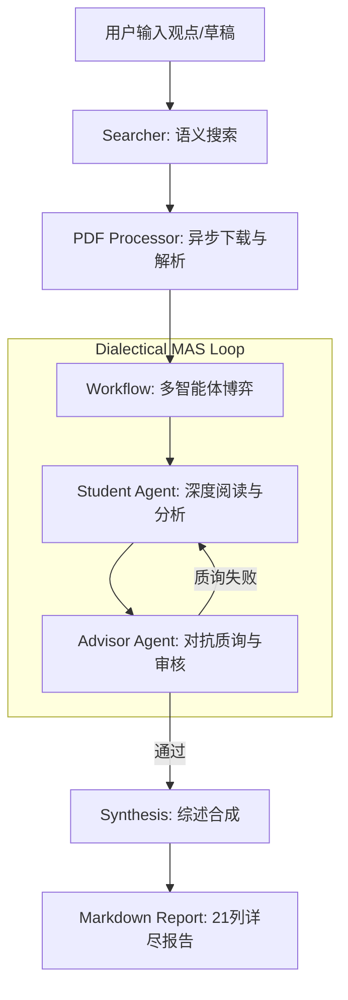

# FindUrCite: 多智能体辩证科研分析系统

FindUrCite 是一款基于多智能体博弈（Multi-Agent System）架构的科研文献深度分析工具。它通过模拟“学生-导师”之间的对抗式辩论，强制进行证据链提取与逻辑校验，旨在彻底解决大模型在科研综述中的幻觉问题。

[](LICENSE)
[](https://www.python.org/)
[](https://ollama.com/)

---

## 🛠️ 工程化核心特性

- **辩证博弈引擎 (Dialectical Engine)**：不同于单向生成的摘要工具，系统内置 `Student` 与 `Advisor` 智能体。`Advisor` 会扮演“杠精”角色，对 `Student` 的分析进行多轮质询，只有通过证据校验的结论才会被采纳。
- **零幻觉证据系统 (Evidence Chain)**：强制执行“无原文引证不输出”策略。每一项分析结果必须映射到 PDF 原文中的具体 Quote。
- **全自动本地流水线**：集成搜索（Semantic Scholar/ArXiv）、PDF 异步下载、语义解析、多轮博弈、多维度评分及报告生成，实现一键式科研闭环。
- **异步流式渲染**：基于 FastAPI WebSocket 实现事件流，前端实时展示智能体辩论过程，支持多模型动态切换。
- **本地部署优先**：支持 Ollama 全系列模型（Qwen2.5, DeepSeek R1 等），确保研究数据的隐私安全。

---

## 🏗️ 系统架构



---

## 🚀 快速开始

### 1. 环境准备
- **操作系统**: Windows 11 (已优化批处理脚本)
- **环境要求**: Python 3.10+, [Ollama](https://ollama.com/)
- **本地模型**: 推荐 `qwen2.5:7b` (平衡) 或 `deepseek-r1:8b` (推理)

### 2. 一键启动
本项目提供完全自动化的 Windows 部署脚本：
```powershell
./run.bat
```
该脚本将自动完成：
- 虚拟环境创建与依赖安装
- Ollama 服务检测与模型自动拉取
- 自动打开浏览器进入 UI 界面

---

## 📊 核心模块说明

| 模块 | 说明 | 关键文件 |
| :--- | :--- | :--- |
| **Agents** | 定义了不同性格和任务的智能体 Prompts 和推理链 | `src/agents/` |
| **Workflow** | 管理辩论状态机、分段打分逻辑及博弈循环 | `src/workflow.py` |
| **Processor** | 负责 PDF 的鲁棒解析与语义文本提取 | `src/pdf_processor.py` |
| **Server** | 提供 WebSocket 实时通信与静态文件托管 | `src/server.py` |

---

## 🛡️ 开发规范与错误处理

项目遵循严格的开发规范，所有已知问题与解决方案均记录在 [error_log.md](error_log.md) 中。主要解决的工程挑战包括：
- Semantic Scholar API 频控绕过
- PDF 解析中的编码与布局兼容性
- 多智能体并发下的 Token 节省策略
- 复杂 Markdown 渲染兼容性

---

## 📈 路线图 (Roadmap)
- [x] 多维度精细化评分 (0-10 分)
- [x] 导师 Agent 动态质询阶段
- [x] 多模型动态切换支持
- [ ] 增加 Zotero 插件集成
- [ ] 支持本地论文库导入分析

---

## 📜 许可证
[MIT License](LICENSE)
