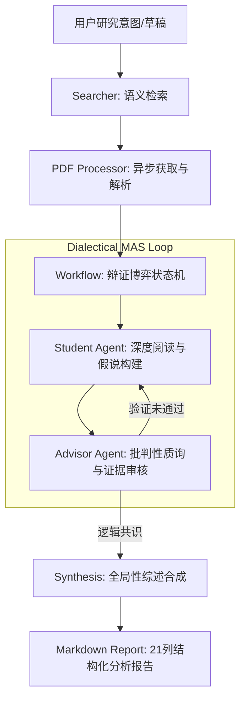

# FindUrCite: 多智能体辩证科研分析系统 / Multi-Agent Dialectical Research Analysis System

[English](#english) | [中文](#chinese)

FindUrCite 是一款基于多智能体博弈（Multi-Agent System）架构的科研文献深度分析系统。它通过模拟“研究员-审查者”之间的对抗式辩论，引入证据约束机制与批判性思维链，旨在系统性缓解大语言模型在科研综述中的幻觉问题，确保每一项分析结论均具备严谨的原文证据支撑。

FindUrCite is a sophisticated literature analysis system powered by a Multi-Agent System (MAS) architecture. By simulating an adversarial debate between a **Researcher Agent** and a **Critical Reviewer Agent**, it implements an evidence-constrained mechanism and critical thinking chains. The system is designed to systematically mitigate LLM hallucinations in academic synthesis, ensuring that every analytical conclusion is rigorously grounded in empirical evidence from the source text.

[](LICENSE)
[](https://www.python.org/)
[](https://ollama.com/)

---

<a name="chinese"></a>

## 🇨🇳 中文说明

### 🛠️ 核心技术特性

- **辩证博弈引擎 (Dialectical Engine)**：系统内置 `Student` (研究员) 与 `Advisor` (审查者) 智能体。`Advisor` 采用 **“魔鬼代言人 (Devil's Advocate)”** 策略，对初稿进行多轮逻辑质询与证据审查，仅在达成共识后输出结论。
- **零幻觉证据链 (Zero-Hallucination Evidence Chain)**：强制执行 **“无引证不结论”** 原则。所有分析点必须精准映射至 PDF 原文中的具体片段 (Evidence Quotes)，实现分析过程的可追溯性。
- **全自动本地科研闭环**：集成精准语义搜索（Semantic Scholar/ArXiv）、异步 PDF 获取、结构化语义解析、多轮博弈对抗、多维度量化评分及详尽报告生成。
- **异步流式响应**：基于 FastAPI WebSocket 构建实时事件流，动态展示智能体之间的辩论逻辑与思维演进过程。
- **隐私优先的本地部署**：全面支持 Ollama 推理框架（推荐 `qwen2.5:7b` 或 `deepseek-r1:8b`），确保敏感研究数据不离开本地环境。

### 🏗️ 系统架构



### 🚀 快速开始

#### 1. 环境依赖
- **操作系统**: Windows 11 (已针对 PowerShell 优化)
- **核心组件**: Python 3.10+, [Ollama](https://ollama.com/)
- **推荐模型**: `qwen2.5:7b` 或具有强推理能力的 `deepseek-r1:8b`

#### 2. 自动化部署
运行本项目提供的自动化初始化脚本：
```powershell
./run.bat
```
该脚本将自动执行：依赖环境校验、虚拟环境构建、核心模型拉取及服务一键启动。

---

<a name="english"></a>

## 🇬🇧 English Description

### 🛠️ Core Technical Features

- **Dialectical Engine**: Features a sophisticated interaction between a **Student Agent** (Researcher) and an **Advisor Agent** (Critical Reviewer). The Advisor employs a **"Devil's Advocate"** strategy, challenging the Researcher's claims through multi-round interrogation until a consensus grounded in logic is reached.
- **Zero-Hallucination Evidence Chain**: Enforces a strict **"No Quote, No Claim"** policy. Every analytical insight is bi-directionally linked to specific text segments (Evidence Quotes) within the original PDF, ensuring 100% traceability.
- **Automated Research Pipeline**: A seamless workflow integrating semantic search (Semantic Scholar/ArXiv), asynchronous PDF retrieval, robust structural parsing, adversarial debate, and multi-dimensional quantitative scoring.
- **Async Stream Rendering**: Powered by FastAPI WebSockets to provide real-time visualization of the agents' dialectical reasoning and evidence extraction progress.
- **Privacy-Centric Local Deployment**: Full integration with the Ollama inference framework, enabling high-performance local execution without compromising data confidentiality.

### 🏗️ System Architecture

(Please refer to the Mermaid diagram in the Chinese section for a visual representation of the MAS loop.)

### 🚀 Quick Start

#### 1. Prerequisites
- **OS**: Windows 11 (Batch scripts optimized for PowerShell)
- **Requirements**: Python 3.10+, [Ollama](https://ollama.com/)
- **Recommended Models**: `qwen2.5:7b` or `deepseek-r1:8b` (Reasoning-focused)

#### 2. Deployment
Execute the automated initialization script:
```powershell
./run.bat
```
This script automates environment verification, dependency installation, model synchronization, and server orchestration.

---

## 📊 核心架构模块 / Core Modules

| 模块 / Module | 专业职能 / Functionality | 核心文件 / Key Files |
| :--- | :--- | :--- |
| **Agents** | 智能体思维链与系统提示词 / Agent CoT and Prompts | `src/agents/` |
| **Workflow** | 辩证博弈状态机与共识算法 / Debate State Machine and Consensus | `src/workflow.py` |
| **Processor** | 鲁棒性 PDF 解析与语义提取 / Robust PDF Parsing and Extraction | `src/pdf_processor.py` |
| **Server** | 实时通信与静态资产托管 / WebSocket and Asset Serving | `src/server.py` |

---

## 📈 演进路线 / Roadmap
- [x] 多维度量化评分体系 (0-10 Scale)
- [x] 动态对抗质询阶段 (Adversarial Phases)
- [x] 实时博弈过程可视化
- [ ] 知识图谱集成 (Knowledge Graph Integration)
- [ ] 自动化消融实验分析 (Automated Ablation Study Analysis)

## 📜 许可证 / License
[MIT License](LICENSE)
